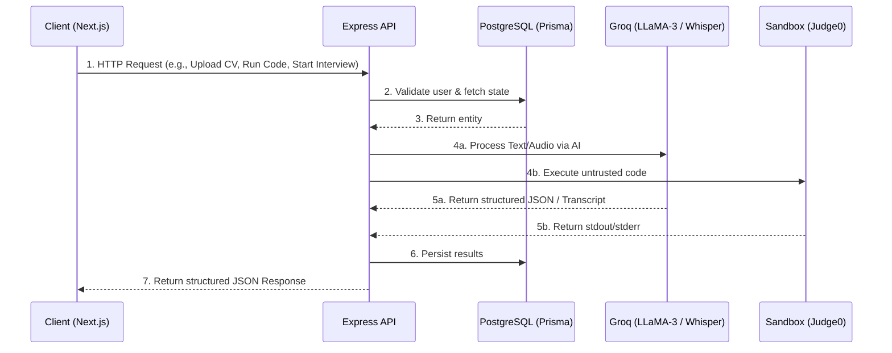

# PrepPal: The Definitive Architecture & Implementation Guide

Welcome to the comprehensive technical documentation for PrepPal. This document breaks down the entire application architecture, detailing the exact flow of data from the frontend user interface down through the API controllers, into the business logic services, interacting with third-party LLMs and Sandboxes, and finally persisting in the PostgreSQL database.

This document serves as the absolute source of truth for the codebase, explaining **every file, every logic block, and every system interaction**.

---

## Table of Contents
1. [System Architecture Overview](#1-system-architecture-overview)
2. [Database Schema (Prisma)](#2-database-schema-prisma)
3. [Module 1: The CV Analyzer Pipeline](#3-module-1-the-cv-analyzer-pipeline)
   - [3.1 Resume Upload & Parsing Flow](#31-resume-upload--parsing-flow)
   - [3.2 Job Description Analysis Flow](#32-job-description-analysis-flow)
   - [3.3 Deterministic Matching Algorithm](#33-deterministic-matching-algorithm)
   - [3.4 Semantic AI Suggestions](#34-semantic-ai-suggestions)
4. [Module 2: The Virtual Interview Simulator](#4-module-2-the-virtual-interview-simulator)
   - [4.1 Session Initialization State](#41-session-initialization-state)
   - [4.2 Real-time Audio Processing Pipeline (Whisper)](#42-real-time-audio-processing-pipeline-whisper)
   - [4.3 Adaptive Questioning Logic (LLaMA-3)](#43-adaptive-questioning-logic-llama-3)
   - [4.4 Final Evaluation Generation](#44-final-evaluation-generation)
5. [Module 3: The Coding Platform & Evaluation Engine](#5-module-3-the-coding-platform--evaluation-engine)
   - [5.1 Problem and Test Case Structure](#51-problem-and-test-case-structure)
   - [5.2 Code Sandbox Execution Flow](#52-code-sandbox-execution-flow)
6. [Frontend State Management & React Architecture](#6-frontend-state-management--react-architecture)

---

## 1. System Architecture Overview

PrepPal operates as a **Monorepo** managed by **Turborepo**.

### The Monorepo Structure
```text
PrepPal/
├── apps/
│   ├── api/                 # Node.js + Express backend
│   │   ├── src/
│   │   │   ├── common/      # Global middleware, error handlers, response envelopes
│   │   │   ├── config/      # Environment variables and Prisma client singleton
│   │   │   └── modules/     # Feature-based architectural domains (AI, Auth, CV, Jobs, Interviews)
│   │   └── prisma/          # schema.prisma and migrations
│   └── web/                 # Next.js 14+ App Router frontend
│       ├── src/
│       │   ├── app/         # Server Components and page routing
│       │   ├── components/  # Reusable UI components (Tailwind + Lucide)
│       │   └── hooks/       # Custom React hooks for state management
├── packages/
│   ├── ui/                  # Shared React components library
│   ├── eslint-config/       # Shared linting rules
│   └── typescript-config/   # Shared tsconfig.json base
└── package.json             # Root monorepo scripts
```

### Sequence Diagram: High-Level Client-Server Interaction


---

## 2. Database Schema (Prisma)

The foundation of the application relies on strongly typed relational models.

```prisma
// schema.prisma

generator client {
  provider = "prisma-client-js"
}

datasource db {
  provider = "postgresql"
  url      = env("DATABASE_URL")
}

model User {
  id           String        @id @default(uuid())
  email        String        @unique
  passwordHash String
  name         String
  resumes      Resume[]
  interviews   Interview[]
  submissions  Submission[]
  createdAt    DateTime      @default(now())
}

model Resume {
  id         String   @id @default(uuid())
  userId     String
  user       User     @relation(fields: [userId], references: [id])
  s3Url      String?  
  rawText    String   // The text extracted via pdf-parse
  parsedData Json     // The strict Zod-enforced JSON from Groq
  createdAt  DateTime @default(now())
}

model Interview {
  id         String   @id @default(uuid())
  userId     String
  user       User     @relation(fields: [userId], references: [id])
  jobRole    String
  transcript Json     // Array of { role: "interviewer" | "candidate", content: string }
  report     Json?    // The final evaluation JSON
  status     String   @default("IN_PROGRESS") // IN_PROGRESS | COMPLETED
  createdAt  DateTime @default(now())
}

model Problem {
  id          String     @id @default(uuid())
  title       String
  description String
  difficulty  String     @default("MEDIUM")
  testCases   TestCase[]
  submissions Submission[]
}

model TestCase {
  id             String  @id @default(uuid())
  problemId      String
  problem        Problem @relation(fields: [problemId], references: [id])
  input          String  // JSON stringified array of arguments
  expectedOutput String  // Expected return value
  isHidden       Boolean @default(false)
}

model Submission {
  id         String   @id @default(uuid())
  userId     String
  user       User     @relation(fields: [userId], references: [id])
  problemId  String
  problem    Problem  @relation(fields: [problemId], references: [id])
  code       String
  language   String   @default("javascript")
  status     String   // PENDING | PASSED | FAILED | RUNTIME_ERROR
  runtime    Float?
  createdAt  DateTime @default(now())
}
```

### Schema Logic Breakdown:
1. **JSON Columns**: Notice the heavy reliance on `Json` for `parsedData`, `transcript`, and `report`. This allows the DB to natively store the dynamic, nested objects returned by our LLM calls while still associating them with strict relational constraints (like `userId`).
2. **TestCase `isHidden`**: The `isHidden` boolean on `TestCase` separates the "Run Code" action (which only executes visible test cases) from the "Submit" action (which runs all test cases to prevent hardcoding solutions).

---

## 3. Module 1: The CV Analyzer Pipeline

This module is the core of the preparation pipeline. It takes an unstructured PDF, turns it into a structured semantic tree, compares it against a job description, and provides AI coaching.

### 3.1 Resume Upload & Parsing Flow

**The Files Involved:**
- `apps/web/src/app/(dashboard)/cv/page.tsx`
- `apps/api/src/modules/resume/resume.controller.ts`
- `apps/api/src/modules/resume/resume.service.ts`
- `apps/api/src/modules/ai/prompts/resume-parse.prompt.ts`

**Step-by-Step Logic:**
1. **Client Action**: The user selects a PDF on the `/cv` page. The React component creates a `FormData` object and POSTs it to the backend.
   ```typescript
   // apps/web/src/app/(dashboard)/cv/page.tsx
   const formData = new FormData();
   formData.append('file', file);
   const res = await fetch('/v1/resume/upload', { method: 'POST', body: formData });
   ```
2. **Controller Routing**: The Express router (`resume.routes.ts`) uses `multer` middleware to intercept the file, saving it to memory or disk. The request reaches `ResumeController.upload`.
3. **Service Logic (PDF Extraction)**: The controller calls `ResumeService.processUpload`.
   - The service utilizes `pdf-parse` to convert the binary PDF buffer into a massive raw string of text.
   ```typescript
   // apps/api/src/modules/resume/resume.service.ts
   import pdfParse from 'pdf-parse';
   const pdfData = await pdfParse(file.buffer);
   const rawText = pdfData.text;
   ```
4. **AI Semantic Parsing**: We need to structure this raw text. The service injects `rawText` into `getResumeParsePrompt`.
   - We define `ResumeParsedSchema` using Zod.
   ```typescript
   // apps/api/src/modules/ai/prompts/resume-parse.prompt.ts
   export const ResumeParsedSchema = z.object({
     name: z.string(),
     email: z.string(),
     skills: z.array(z.string()),
     education: z.array(z.object({ institution: z.string(), degree: z.string(), year: z.string() })),
     experience: z.array(z.object({ company: z.string(), role: z.string(), description: z.string() })),
     projects: z.array(z.object({ name: z.string(), technologies: z.array(z.string()) }))
   });
   ```
5. **Groq Execution**: The backend calls `aiClient.generateStructured(prompt, ResumeParsedSchema)`. The Groq API (running LLaMA-3) is instructed to output strictly valid JSON matching our Zod schema.
6. **Database Persistence**: The resulting `parsedData` is saved to PostgreSQL.
   ```typescript
   const newResume = await prisma.resume.create({
     data: { userId, rawText, parsedData }
   });
   ```
7. **Client Update**: The React UI receives the structured JSON and maps over the `parsedData.skills` and `parsedData.experience` arrays to dynamically render the user's digital CV profile on screen.

### 3.2 Job Description Analysis Flow

**The Files Involved:**
- `apps/web/src/app/(dashboard)/jobs/page.tsx`
- `apps/api/src/modules/jobs/jobs.controller.ts`
- `apps/api/src/modules/ai/prompts/job-parse.prompt.ts`

**Step-by-Step Logic:**
1. **Client Action**: User pastes raw text from LinkedIn into the "Analyze Job" textarea and hits Submit.
2. **Controller Action**: `JobsController.analyze` receives the `description` string.
3. **AI Semantic Parsing**: The controller utilizes `getJobParsePrompt`. The goal is to separate generic HR jargon from actual technical requirements.
   ```typescript
   // apps/api/src/modules/ai/prompts/job-parse.prompt.ts
   export const JobParsedSchema = z.object({
     role: z.string(),
     requiredSkills: z.array(z.string()),
     preferredSkills: z.array(z.string()),
     concepts: z.array(z.string()),
   });
   ```
4. **Response**: The frontend receives the exact technical blueprint of the job, rendering red tags for required skills and amber tags for preferred skills.

### 3.3 Deterministic Matching Algorithm

**The Files Involved:**
- `apps/api/src/modules/matching/matching.controller.ts`
- `apps/api/src/modules/resume/matcher.service.ts`

**The Logic (The Critical Paradigm Shift):**
Why don't we just ask the AI "What is the match percentage?" Because LLMs hallucinate numbers. They might give 80% one day and 95% the next. 

Instead, we use pure Set Theory in Node.js.

```typescript
// apps/api/src/modules/resume/matcher.service.ts
public match(candidate: any, job: any) {
    // 1. Flatten candidate skills
    const candidateSkills = (candidate.skills || []).map(s => s.toLowerCase());
    
    // Extract deep skills from candidate projects
    candidate.projects?.forEach(p => {
        p.technologies?.forEach(t => candidateSkills.push(t.toLowerCase()));
    });

    const uniqueCandidateSkills = new Set(candidateSkills);

    // 2. Map Job Requirements
    const required = (job.requiredSkills || []).map(s => s.toLowerCase());
    const preferred = (job.preferredSkills || []).map(s => s.toLowerCase());
    
    // 3. Find Intersections (The Math)
    const matchedRequired = required.filter(req => uniqueCandidateSkills.has(req));
    const missingRequired = required.filter(req => !uniqueCandidateSkills.has(req));

    // 4. Weighted Scoring Algorithm
    // Out of a total 100 points: Required skills are worth 50 points, Preferred 25, Concepts 25.
    const requiredScore = required.length > 0 ? (matchedRequired.length / required.length) * 50 : 50;
    const preferredScore = preferred.length > 0 ? (matchedPreferred.length / preferred.length) * 25 : 25;
    
    const totalScore = Math.round(requiredScore + preferredScore + ...);
    
    return { matchScore: totalScore, missingSkills: { critical: missingRequired } };
}
```
This guarantees that if the Job requires "React" and the CV does not have "React", the score drops predictably and deterministically.

### 3.4 Semantic AI Suggestions

**The Files Involved:**
- `apps/api/src/modules/matching/matching.controller.ts`
- `apps/api/src/modules/ai/prompts/suggestions.prompt.ts`

**The Logic:**
Now that we have mathematically proven what the user is missing, we ask the AI for advice.
1. The frontend calls `POST /v1/matching/suggestions`.
2. We pass both the `CandidateJSON` and the `JobJSON` to the `SuggestionsSchema`.
3. The prompt explicitly instructs: *"Do NOT invent achievements. Only suggest wording improvements for their existing bullet points to better align with the JD."*
4. The AI returns an array of `wordingImprovements` containing `{ original, improved, reason }`, which the React frontend renders as side-by-side diffs.

---

## 4. Module 2: The Virtual Interview Simulator

The virtual interview is a real-time, stateful conversational agent. 

### 4.1 Session Initialization State
When a user starts an interview (`POST /v1/interviews/start`), we create an `Interview` record in the database.
The most important column is the `transcript` JSON array. It starts empty.

### 4.2 Real-time Audio Processing Pipeline (Whisper)

**The Files Involved:**
- `apps/web/src/components/interview/AudioRecorder.tsx`
- `apps/api/src/modules/interviews/interviews.controller.ts`

**The Logic:**
1. **Frontend**: We use the browser's `MediaRecorder` API to capture the user's microphone.
   ```javascript
   const stream = await navigator.mediaDevices.getUserMedia({ audio: true });
   const mediaRecorder = new MediaRecorder(stream);
   // On stop, we get an audio Blob
   ```
2. **Streaming**: The Blob is appended to a `FormData` object and sent to `POST /v1/interviews/:id/speak`.
3. **Backend Transcription**: The Express backend uses `multer` to intercept the audio file. It immediately forwards this binary stream to Groq's **Whisper-large-v3-turbo** API.
   ```typescript
   // Pseudo-code
   const transcription = await groqClient.audio.transcriptions.create({
     file: fs.createReadStream(audioFile.path),
     model: "whisper-large-v3-turbo",
   });
   const userText = transcription.text;
   ```

### 4.3 Adaptive Questioning Logic (LLaMA-3)
Once we have the user's text from Whisper:
1. We append the user's response to the database `transcript`.
   ```json
   [
     { "role": "interviewer", "content": "Tell me about a time you optimized a database." },
     { "role": "candidate", "content": "I added an index to a PostgreSQL table..." } // Newly appended
   ]
   ```
2. We pass the *entire* transcript array to LLaMA-3.
3. We prompt the LLM: *"You are a senior engineering manager. Look at the transcript. Evaluate the candidate's last answer silently, and then ask exactly one follow-up question. If they missed details, probe deeper. If they answered perfectly, move to a new topic."*
4. The LLM generates the next question. We append it to the `transcript` and return it to the frontend.
5. The frontend displays the text, and can optionally use a Web Speech Synthesis API to read the text aloud, creating a seamless conversational loop.

### 4.4 Final Evaluation Generation
When the user clicks "End Interview":
1. We call `POST /v1/interviews/:id/evaluate`.
2. The entire transcript is fed into a massive prompt with a Zod `EvaluationSchema`.
3. The LLM acts as an impartial grading committee, returning:
   ```json
   {
     "technicalScore": 85,
     "communicationScore": 90,
     "feedback": {
       "strengths": ["Clear explanation of indexing"],
       "weaknesses": ["Forgot to mention composite indexes"]
     }
   }
   ```
4. This JSON is saved to the `Interview.report` column and displayed in a beautiful dashboard on the frontend.

---

## 5. Module 3: The Coding Platform & Evaluation Engine

This module provides a secure, deterministic environment for practicing DSA (Data Structures and Algorithms).

### 5.1 Problem and Test Case Structure

As defined in the database schema, a `Problem` has many `TestCase`s.

Example `TestCase` row in DB:
- `problemId`: `123`
- `input`: `"[2,7,11,15], 9"`
- `expectedOutput`: `"[0,1]"`
- `isHidden`: `false`

### 5.2 Code Sandbox Execution Flow

**The Files Involved:**
- `apps/web/src/app/(dashboard)/coding/page.tsx`
- `apps/api/src/modules/coding/coding.controller.ts`

**The Logic:**
Unlike standard competitive programming platforms that require users to write `int main()` and handle `cin/cout` or `Scanner`, PrepPal abstracts I/O. Users simply write the core logic function.

1. **Frontend Editor**: The user writes code in Monaco Editor:
   ```javascript
   function twoSum(nums, target) {
      const map = new Map();
      for (let i = 0; i < nums.length; i++) {
          const complement = target - nums[i];
          if (map.has(complement)) return [map.get(complement), i];
          map.set(nums[i], i);
      }
   }
   ```
2. **Backend Submission (`POST /v1/coding/execute`)**:
   - The backend receives the raw string of code.
   - It fetches the test cases from the database.
3. **The Wrapper Script**:
   - To execute the code without requiring the user to handle I/O, the backend dynamically prepends the user's code to a wrapper script.
   ```javascript
   // Backend dynamically generates this string:
   const fullScript = `
   ${userCode}

   // PrepPal Evaluation Wrapper
   const result = twoSum(${testCase.input});
   console.log(JSON.stringify(result));
   `;
   ```
4. **Sandbox Execution**:
   - The `fullScript` string is sent to an isolated execution environment (like Judge0 API, or a local Docker spawned via `child_process.exec`).
   - The sandbox runs `node script.js`.
5. **Verification**:
   - The sandbox returns `stdout`.
   - The backend compares the raw string of `stdout` (e.g., `"[0,1]\n"`) to the `TestCase.expectedOutput`.
   - Stripping whitespace and normalizing, if they match exactly, the test passes.
6. **Hidden Test Cases**:
   - When the user clicks "Run", the backend only loops over test cases where `isHidden = false`.
   - When the user clicks "Submit", the backend loops over ALL test cases.
   - If a hidden test fails, the submission is recorded as `FAILED`, and the user's progress is updated.

---

## 6. Frontend State Management & React Architecture

The Next.js App Router frontend is built heavily on Server Components for SEO and fast initial loads, but deep interactive modules rely on Client Components (`"use client"`).

### CV Matching Page State Lifecycle
In `apps/web/src/app/(dashboard)/jobs/page.tsx`, the state transitions through multiple phases:
1. `isAnalyzing` (Boolean): Triggers a spinning loader while the JD is parsed by AI.
2. `analyzedJob` (Object): The resulting JSON from the JD.
3. `isMatching` (Boolean): Triggers when calculating the deterministic match against the CV.
4. `matchResult` (Object): Renders the mathematically proven ✅ and ❌ lists.
5. `isGettingSuggestions` (Boolean): Triggers the LLM call for bullet point revisions.
6. `suggestions` (Object): Renders the final AI coaching UI.

This sequential state pattern ensures the UI remains responsive, guiding the user step-by-step through the heavy backend processing layers.

---

*End of Document. This architectural blueprint dictates the complete flow of data, state, and execution within the PrepPal ecosystem.*
